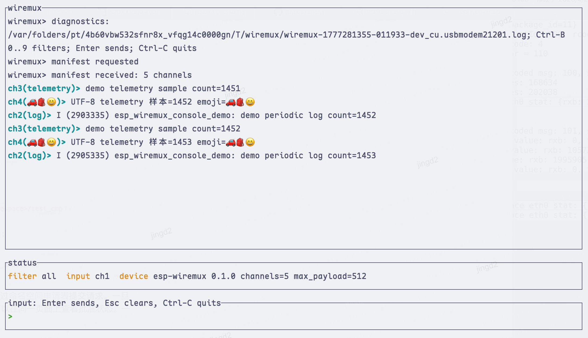
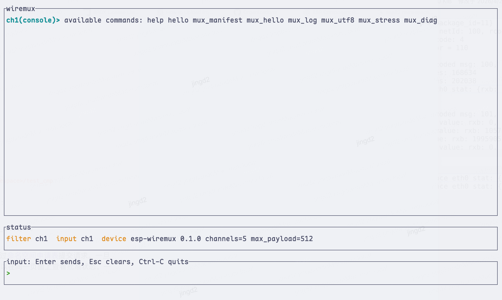
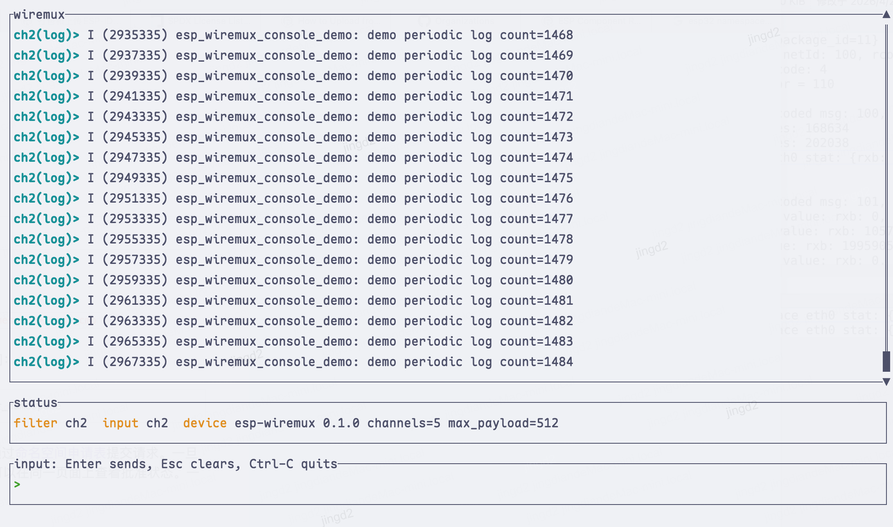
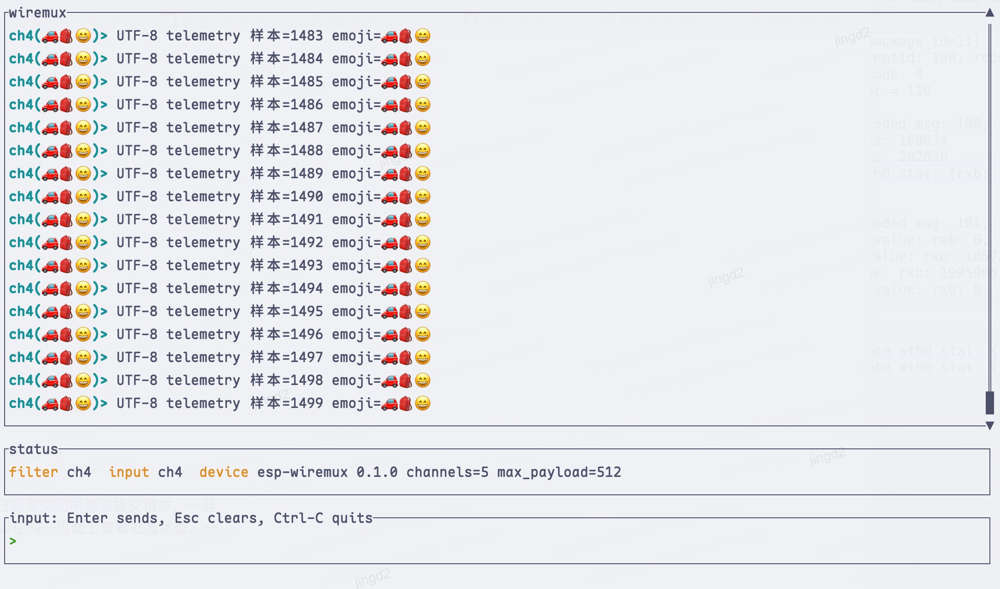

# Wiremux

[English](README.md)

[](VERSION)
[](LICENSE)

Wiremux 是一个面向串口类字节流的轻量多路复用协议。它可以在一个 UART、USB CDC、USB Serial/JTAG、TCP bridge 或其他有序字节 transport 上同时承载多个逻辑 channel，让日志、console 命令、telemetry 和诊断数据不再挤在同一个原始字节流里。

当前仓库提供的参考设备侧接入是 ESP32/ESP-IDF component 和 demo，但协议核心刻意抽离为平台无关的 C 代码。

当前仓库包含：

- `sources/core/c`：平台无关的 C 协议核心。
- `sources/vendor/espressif/generic/components/esp-wiremux`：ESP-IDF adapter component。
- `sources/vendor/espressif/generic/examples/esp_wiremux_console_demo`：ESP-IDF console 示例。
- `sources/host/wiremux`：Rust host 工具，提供 `listen`、`send` 和 TUI 模式。

## 适用场景

串口开发中常见的一个问题是：启动日志、应用日志、console 输入、调试文本和 telemetry 都通过同一个连接输出。Wiremux 在传输层保持简单，只在字节流上增加一个带 CRC 的 frame 和 protobuf-compatible envelope：

- channel 0：system/control，例如 device manifest。
- channel 1：ESP-IDF demo 中的 line-mode console 输入输出。
- channel 2：ESP-IDF demo 中的 log 输出。
- channel 3 及之后：telemetry、诊断、二进制 payload 或业务数据。
- Host 工具可以按 channel 过滤、保留普通 terminal 字节，并通过 manifest 获取 channel 名称和能力。

## 截图

| 全部 channel | Console channel |
| --- | --- |
|  |  |

| Log channel | UTF-8 channel |
| --- | --- |
|  |  |

## 设备侧接入

Wiremux 分为两层：

- `sources/core/c`：平台无关的 frame、envelope、manifest、batch 和 compression 基础能力。
- `sources/vendor/espressif/generic/components/esp-wiremux`：基于 portable core 实现的 ESP-IDF adapter。

如果要为新的平台写 adapter，可以直接使用 portable core：

```c
#include "wiremux_frame.h"

uint8_t payload[] = {0x01, 0x02, 0x03};
uint8_t frame[128];
size_t written = 0;

wiremux_frame_header_t header = {
    .version = WIREMUX_FRAME_VERSION,
    .flags = 0,
};

wiremux_status_t status = wiremux_frame_encode(&header,
                                               payload,
                                               sizeof(payload),
                                               frame,
                                               sizeof(frame),
                                               &written);
```

ESP-IDF 中可以初始化 adapter、注册业务 channel，然后向 channel 写入记录：

```c
#include "esp_wiremux.h"

void app_main(void)
{
    esp_wiremux_config_t config;
    esp_wiremux_config_init(&config);
    ESP_ERROR_CHECK(esp_wiremux_init(&config));

    esp_wiremux_channel_config_t telemetry = {
        .channel_id = 3,
        .name = "telemetry",
        .description = "Application telemetry",
        .directions = ESP_WIREMUX_DIRECTION_OUTPUT,
        .default_payload_kind = ESP_WIREMUX_PAYLOAD_KIND_TEXT,
        .interaction_mode = ESP_WIREMUX_CHANNEL_INTERACTION_UNSPECIFIED,
    };
    ESP_ERROR_CHECK(esp_wiremux_register_channel(&telemetry));

    ESP_ERROR_CHECK(esp_wiremux_start());
    ESP_ERROR_CHECK(esp_wiremux_write_text(3,
                                           ESP_WIREMUX_DIRECTION_OUTPUT,
                                           "temperature=24.8\n",
                                           100));
}
```

把 ESP-IDF console 绑定到 Wiremux line-mode channel：

```c
#include "esp_wiremux_console.h"

esp_wiremux_console_config_t console_config;
esp_wiremux_console_config_init(&console_config);
console_config.channel_id = 1;
console_config.mode = ESP_WIREMUX_CONSOLE_MODE_LINE;
ESP_ERROR_CHECK(esp_wiremux_bind_console(&console_config));
```

把 ESP log 输出捕获到独立 channel：

```c
#include "esp_wiremux_log.h"

esp_wiremux_log_config_t log_config;
esp_wiremux_log_config_init(&log_config);
log_config.channel_id = 2;
log_config.tee_to_previous = true;
ESP_ERROR_CHECK(esp_wiremux_bind_esp_log(&log_config));
```

## Host 工具

构建和运行 Rust host 工具：

```bash
cd sources/host/wiremux
cargo run -- listen --port /dev/tty.usbmodem2101 --baud 115200
cargo run -- listen --port /dev/tty.usbmodem2101 --baud 115200 --channel 1 --line help
cargo run -- passthrough --port /dev/tty.usbmodem2101 --baud 115200 --channel 1
cargo run -- tui --port /dev/tty.usbmodem2101 --baud 115200 --tui-fps 120
```

常用命令：

- `listen`：从串口 mixed stream 中解码普通 terminal 输出和 Wiremux frame。
- `listen --channel N`：只输出指定 channel 的 decoded payload。
- `listen --line TEXT`：连接后发送一次 host-to-device input frame，然后继续用同一个串口 handle 监听。
- `send`：发送一次 input frame 后退出。
- `passthrough --channel N`：attach 到一个 mux channel 并立即转发按键；`Ctrl-]` 或先按 `Esc` 再按 `x` 退出。可选 `--interactive-backend auto|compat|mio`，`auto` 在 Unix 上优先使用 `mio`，其他平台使用 `compat`。
- `tui`：打开 ratatui 交互界面，支持 channel 过滤、滚动历史、可选中复制的输出/status 文本、manifest 展示、status 中的 backend/FPS 信息、原生输入光标、manifest 驱动的 line/passthrough 输入，以及 generic enhanced 虚拟串口；`Ctrl-C`、`Ctrl-]` 或先按 `Esc` 再按 `x` 退出。`Ctrl-B v` 切换当前 session 的虚拟串口，`Ctrl-B o` 切换当前 channel 的输入 owner。可用 `--interactive-backend auto|compat|mio` 选择事件 backend，用 `--tui-fps 60|120` 覆盖默认 60 fps / Ghostty 自动 120 fps。

macOS 上可以传入 `/dev/tty.usbmodem*`，host 工具会优先尝试配对的 `/dev/cu.usbmodem*`。

host 全局配置可以控制 generic enhanced 虚拟串口。generic host 不包含这个 overlay，
会忽略 `[virtual_serial]`。省略 `[virtual_serial]` 时，generic enhanced、vendor
enhanced 和 all-feature 构建默认启用，并导出 manifest 中的所有 channel。output-only
channel 是只读 PTY；input-capable channel 只有在输入 owner 切换到虚拟串口后才会转发写入。

vendor enhanced ESP32 host 构建会在 TUI 中为识别到的 Espressif manifest
额外创建稳定的 `tty.wiremux-esp-enhanced` alias。请使用 TUI 显示的实际路径：
如果 `/dev` alias 可创建，通常是 `/dev/tty.wiremux-esp-enhanced`；否则会回退到
用户可写的 `/tmp/wiremux/tty/tty.wiremux-esp-enhanced`。`wiremux tui` 持有真实
物理串口时，这个 endpoint 可作为聚合 channel monitor；`idf.py flash --port
<TUI 显示的 esp-enhanced 路径> --baud 115200` 会通过完整 esptool SYNC frame
触发，随后 TUI 使用 DTR/RTS 让设备进入 ROM bootloader，并在 flashing client
断开前进行 raw byte bridge。显式 `--baud 115200` 可避免 esptool 对 macOS PTY
发起会失败的高波特率 ioctl；后续 roadmap 是用 native DriverKit virtual serial
支持默认高波特率刷写。普通 channel 虚拟串口的 input owner 规则不变。

```toml
[virtual_serial]
enabled = true
export = "all-manifest-channels"
name_template = "wiremux-{device}-{channel}"
```

Windows 暂时只保留虚拟串口接口占位，后续再接入 native virtual COM backend。

## ESP-IDF 示例

使用 ESP-IDF v5.4 或更新版本：

```bash
cd sources/vendor/espressif/generic/examples/esp_wiremux_console_demo
idf.py set-target esp32s3
idf.py build flash monitor
```

烧录后，启动 host 工具前请先停止 `idf.py monitor`。多数串口设备同一时间只适合被一个进程占用。

通过 Wiremux channel 1 执行 console 命令：

```bash
cd sources/host/wiremux
cargo run -- listen --port /dev/tty.usbmodem2101 --baud 115200 --channel 1 --line help
```

向 console channel 发送命令，同时观察其他输出 channel：

```bash
cargo run -- listen --port /dev/tty.usbmodem2101 --baud 115200 --send-channel 1 --channel 2 --line mux_log
cargo run -- listen --port /dev/tty.usbmodem2101 --baud 115200 --send-channel 1 --channel 3 --line mux_hello
cargo run -- listen --port /dev/tty.usbmodem2101 --baud 115200 --send-channel 1 --channel 4 --line mux_utf8
```

## 文档

- [Product Architecture](docs/product-architecture.md)
- [Source Layout and Build Orchestration](docs/source-layout-build.md)
- [Host CLI](docs/zh/host-tool.md)
- [快速开始](docs/zh/getting-started.md)
- [ESP-IDF Console 接入](docs/zh/esp-idf-console-integration.md)
- [故障排查](docs/zh/troubleshooting.md)

## License

Wiremux 基于 [Apache License 2.0](LICENSE) 开源。

## Star History

[](https://www.star-history.com/#magicdian/wiremux&Date)
